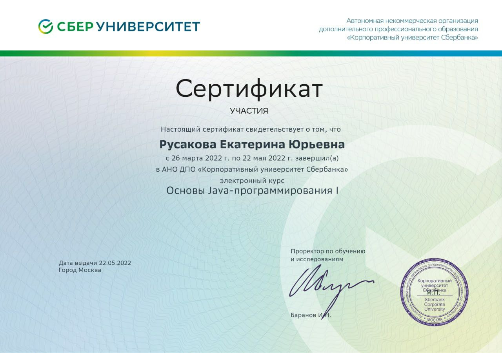

# Пару слов о себе

Приветствую, посетитель моего GitHub! Меня зовут Екатерина, и мне 31 год. Я начинающий тестировщик, проживающий в Москве и здесь я расскажу немного о себе.

### Факты обо мне: 

На сегодняшний день я работаю в крупной компании ПАО Сбербанк уже на протяжении 13 лет. За это время я сменила траекторию с менеджера по продажам на старшего менеджера по обслуживанию частных лиц. Я постоянно прохожу обучение в своей области, но в 2022 году решила координально сменить сферу деятельности и начала проходить обучение по направлению программирования, а именно изучать Java. В 2022 году я прошла 2 курса в АНО ДПО "Корпоративный университет Сбербанка":
 

В 2023 году заинтересовалась профессией "Тестировщик ПО" на языке Java и начала активно вникать в данную профессию. Прощла профильный курс "Тестировщик ПО", в котором получила следующие навыки:

- Понимание жизненного цикла разработки программного обеспечения
- Программирование на Java
- Использование объектно-ориентированного программирования
- Работа с системой контроль версий Git, платформой GitHub
- Проведение unit-тестирования
- Подготовка и проведение автоматизированных тестовых сценариев
- Подготовка отчёта о тестировании, заведение дефектов
- Работа в Selenide
На обучении было много интересных задачь и работ, с которыми Вы можете ознакомиться на моей стринице в GIT. 

В декабре получила диплом о профессиональной переподготовке

В данный момент не останавливаюсь на достигнутом и продолжаю постигать гранить науки по средством открытых тематических источников и соотведствующей литературы

В свободное время занимаюсь благотворительностью и учавствую в волонтерской деятельности; изучаю платформу Tilda для расширения кругозора; изучаю английский, ведь без него не обойтись.

